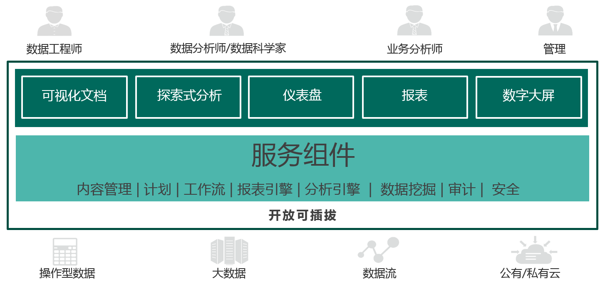

### 简介

“Datafor数据可视化与分析”是上海数为信息技术有限公司在Pentaho平台上发布的一款数据可视化及数据探索分析软件。帮助您轻松制作和共享数据可视化及探索式分析文档，帮助企业高效、快速的理解和探索数据的价值，监控数据，发现问题，辅助企业业务运行和为决策提供数据支撑。

### 设计目标
- 面向未来的智能型数据可视化与分析工具
  - 增强型数据分析

    利用机器学习与人工智能改变分析内容的开发、使用与共享方式，以提高数据分析的效率和准确性。

  - 实时分析

    实时摄取设备、传感器、日志文件、金融交易系统等海量数据，并将数据实时可视化，发现问题并分析问题原因。

- 适合每个人的自助分析

  - 具有开放性、可嵌入性和可扩展性。实现快速部署、数据源集成、高性能计算、探索式分析，确保开发人员和业务用户都能轻松地将数据转化为价值。

### “Datafor文档”组成模块

Datafor基于Pentaho PBA设计，以插件形式与Penaho PBA集成。主要有数据查询组件、服务组件、数据可视化、分析、嵌入和分享等模块组成。

|   模块   |  功能    |
| ---- | ---- |
| 数据查询组件 | 封装数据查询对象、解析分析引擎返回的结果                     |
|   服务组件   | 定义多维模型、可视化组件扩展服务、语言国际化服务、日志和审计输出等 |
|    可视化    | 可视化元素渲染、页面布局等                                   |
|     分析     | 数据多维分析、预警、分类、趋势等                             |
|  嵌入和分享  | 导出功能、嵌入URL生成、自适应设置、发送邮件等功能            |

