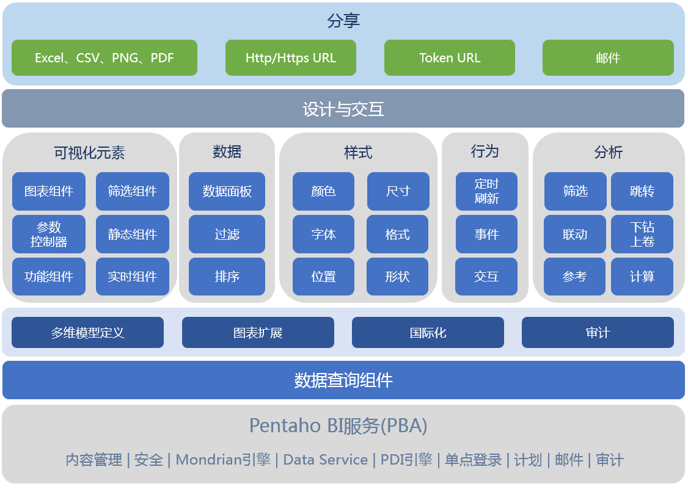

### 什么是Visualizer

“Visualizer”是Pentaho PBA的一个"敏捷BI"插件。

### 您可以使用Visualizer做什么

#### 可视化您的数据

- 使用数据图表（包括折线图，条形图和饼图，地理图，面积图和气泡图，分页数据表，数据透视表等）来讲述您的数据故事。
- 链接和可单击的图像以创建产品目录，视频库和其他超链接内容。
- 用文本和图像对页面进行注释和标记。
- 个性化样式和颜色主题，使您的数据故事成为数据可视化艺术作品。

#### 分析您的数据

- 从来自不同源的多个数据集中发现见解。
- 在单一视图中查看所有数据。
- 通过联动、下钻、跳转、地理分布等进一步加深了解。
- 使用计算、汇总、趋势、排序、筛选等方法探索您的数据。

#### 分享您的数据

- 将数据嵌入其它系统中，包括企业门户、移动应用、协作办公系统等。
- 通过分享页面链接，邀请别人查看或编辑您的数据。
- 将数据导出到邮件、幻灯片、Excel，分享您的数据。

### 哪些场景需要Visualizer

- 报表、仪表盘、数字化报告的敏捷开发
- 实时数据监控敏捷开发
- 适应手机的流式布局的仪表盘敏捷开发
- 自助式日常数据分析
- 数字大屏展示敏捷开发
- 嵌入式分析和可视化页面敏捷开发