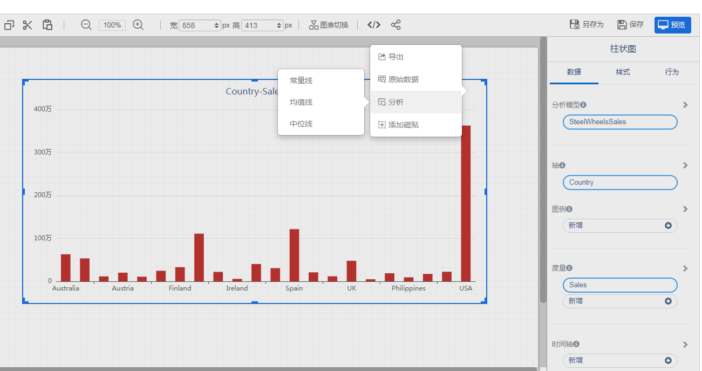
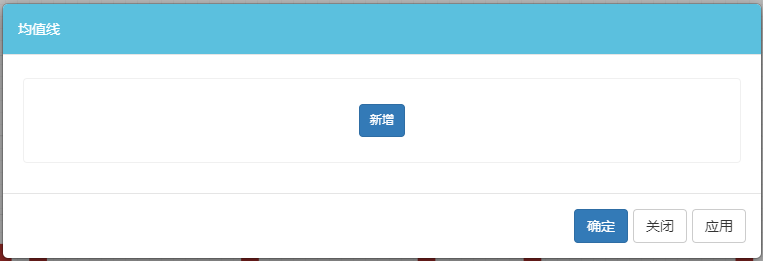
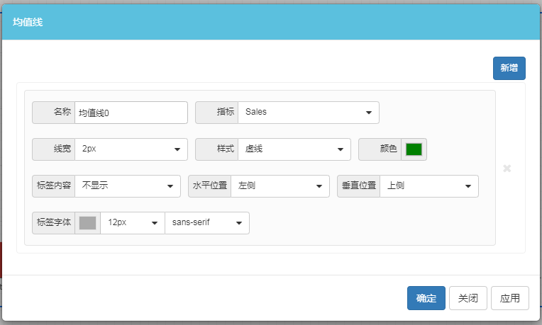
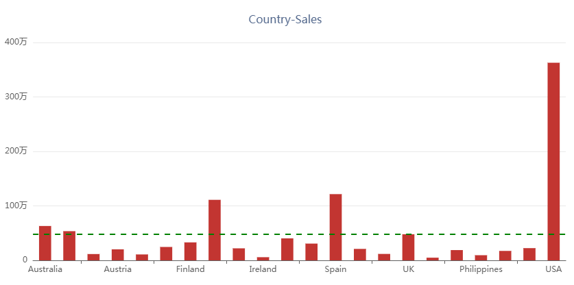
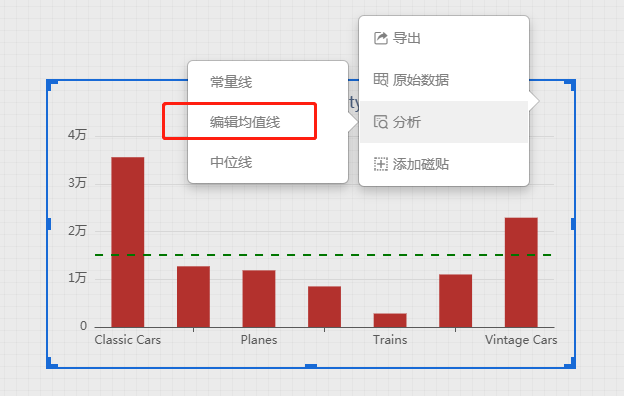

为了让数据图表更加清晰易懂，有时候需要为图表添加一些参考线，例如常量线、均值线、中位线等。

Visualizer在页面编辑状态和预览状态都可以设置参考线。

下表是两种状态设置参考线的不同：

| 功能               | 编辑 | 预览   |
| ------------------ | ---- | ------ |
| 是否跟页面一起保存 | 保存 | 不保存 |
| 参考线设置项目     | 灵活 | 简单   |

### 如何创建参考线

1. 在组件菜单中选择“分析”菜单中，选择需要创建的参考线。
    

2. 点击“新增”按钮

   

3. 设置参考线值和样式

   

4. 完成参考线设置

   

### 如何删除参考线

1. 在组件菜单中，选择参考线类型

   

2. 点击参考线右侧的删除按钮

   