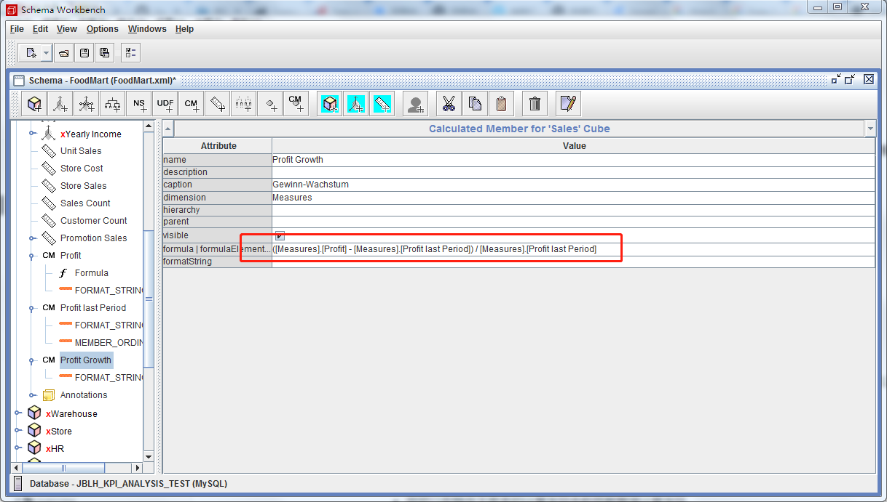
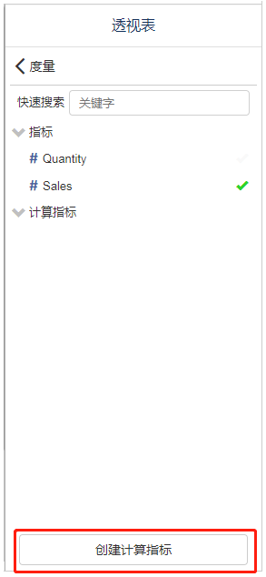
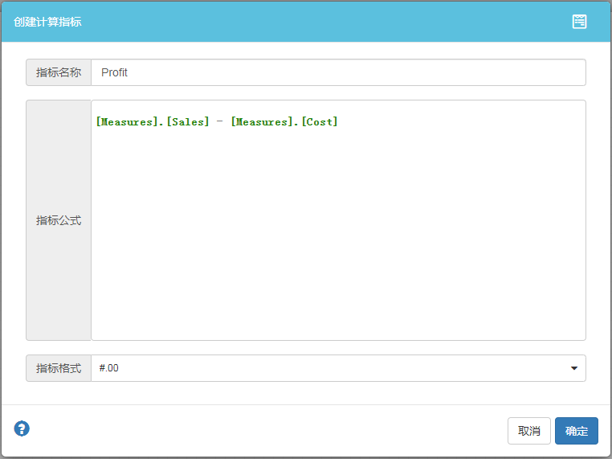
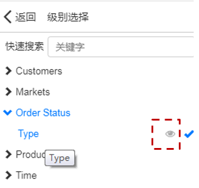
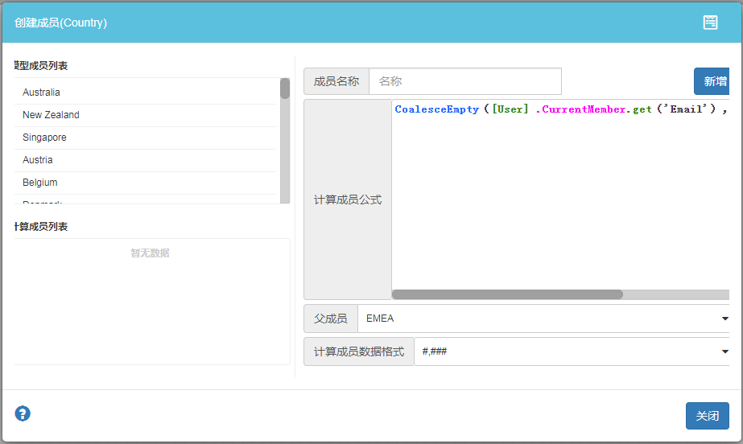

计算度量和计算成员可让您创建从分析模型派生的新度量和维度。通过计算度量和计算成员，您可以扩展和转换来自数据源的信息，并在Visualizer页面中查看结果。

**以下将“计算度量和计算成员”统称为“计算字段”**

### 计算字段如何工作

计算字段是对数据源中一个或多个其他字段执行某些操作的公式。计算字段可以执行算术和数学运算，处理文本，日期和地理信息，并使用判断逻辑返回不同的结果。

例如，假设您创建一个名为“销售利润”的计算字段，该字段的计算公式是“销售金额 - 销售成本”：

```
[Measures].[Sales] - [Measures].[Cost]
```

计算公式语法和可使用的运算和函数，请参考[Pentaho MDX语法](https://mondrian.pentaho.com/documentation/mdx.php)

### “分析模型计算字段”或“组件级计算字段”

有2种类型的计算字段，具体取决于创建位置：在分析模型中，还是在页面的特定组件中。

#### 分析模型中的计算字段

- 在使用该分析模型的任何页面中都可以使用计算字段。

- 可以在图表，控件和其他计算字段中使用分析模型的计算字段，就像常规字段一样。

- 可以像常规字段一样对分析模型的计算字段进行过滤。

  **创建分析模型计算字段需要用到`“Pentaho Schema Workbenach",数据源向导目前不支持创建计算字段。**

  

#### 组件级计算字段

您可以将计算的字段直接添加到Visualizer页面数据组件中。这些特定于组件的（也称为“组件级”）计算字段可以进行数学运算，使用函数并返回基于CASE语句的结果，就像分析模型中的计算字段一样。

组件级计算字段相对于分析模型计算字段具有一些优势：

- 快速轻松地添加字段，无需修改分析模型。
- 可以基于混合分析模型创建计算字段。


**下表总结了这两种计算字段之间的区别：**

| 特征                   | 分析模型计算字段         | 组件级计算字段         |
| :--------------------- | :----------------------- | :--------------------- |
| 谁可以创造？           | Pentaho Schema Workbench | Visualizer             |
| 处理混合数据？         | 没有                     | 是                     |
| 可以在哪里使用该字段？ | 任何基于此分析模型的报告 | 仅创建它的特定数据组件 |

### 如何创建计算字段

#### 分析模型计算字段

[	请参考Pentaho相关文档](https://help.pentaho.com/Documentation/5.1/0N0/0S0/050)

#### 组件级计算字段

##### 创建计算度量

特定组件的计算字段仅存在于创建它们的组件中。

要创建特定于组件的计算字段：

1. 编辑页面。

2. 选择一个图表。

3. 新增度量

4. 在度量列表底部，单击“ **创建计算度量”**。

   

5. 输入计算度量名称。

6. 输入计算度量公式。

7. 适当调整“度量格式”。

   

8. 单击“ **确定”**。

##### 创建计算成员
1. 编辑页面。

2. 选择一个图表。

3. 新增维度

4. 点击维度字段浮动按钮。
	
	
	
5. 输入计算成员名称。

6. 输入计算成员公式。

7. 设置计算成员的“父成员”和计算成员“数据格式”。

   

8. 单击“ **确定”**。

### 对计算字段进行故障排除

如果计算得出的字段公式中有错误，您将看到一条警告消息，并且您将无法保存该字段。以下是一些可能会拒绝公式的原因：

| 错误信息或原因                                 | **可能的解决方案**                                           |
| :--------------------------------------------- | :----------------------------------------------------------- |
| 无效的字段名称                           | 检查字段名称中的拼写和任何特殊字符。                         |
| 无效的函数名称                            | 检查[函数语法](https://mondrian.pentaho.com/documentation/mdx.php) |
| 缺少引号                                     | 确保所有字符串文字均正确引用。                               |
| 括号不匹配 | 确保右括号的数量与右括号的数量相同，并且它们在正确的位置。   |

