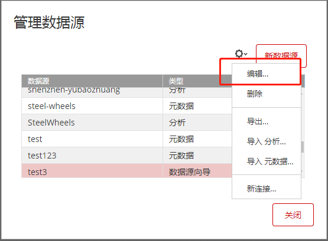
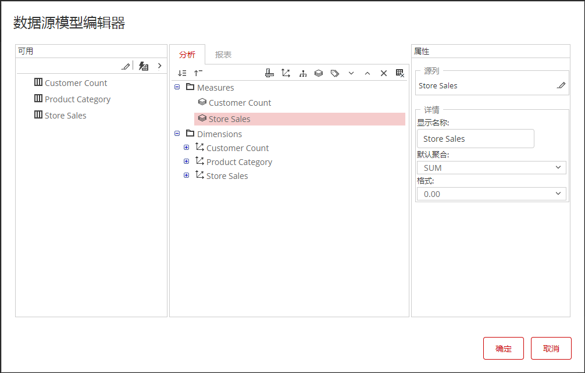
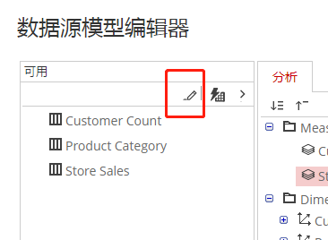

当业务数据发生变化，导致物理数据模型调整或者分析需求的变化导致多维分析模型需要调整，您可以使用模型的“编辑”功能调整模型。

### 编辑“数据源向导”创建的分析模型

1. 登录到“Pentaho用户控制台”

2. 从菜单或快捷按钮选择”管理数据源“

3. 选中需要编辑的模型，选择菜单中的“编辑”选项

   

4. 打开“数据源模型编辑器”，进行模型调整

   

5. 如果物理表结构发生变化，点击编辑数据按钮，重新定义物理模型机构。

   

### 删除分析模型

1. 登录到“Pentaho用户控制台”
2. 从菜单或快捷按钮选择”管理数据源“
3. 选中需要删除的模型，选择菜单中的“删除”选项

**如果当前模型已经在页面中使用，则删除模型不会发出警告。**

