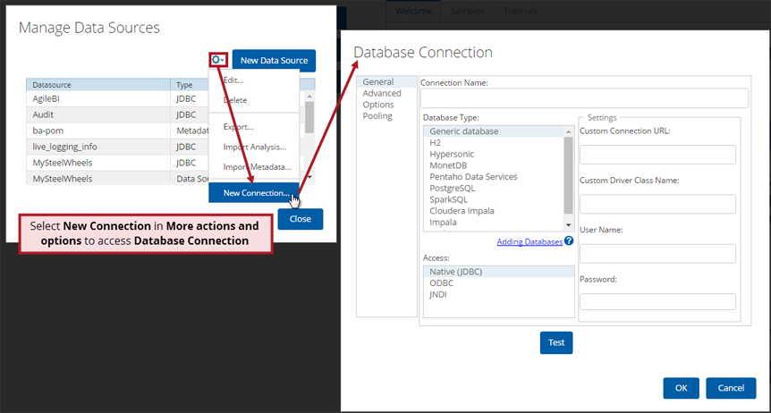

### 连接到您的数据

使用Visualizer可视化与分析您的数据，第一步是连接到您的数据。您的数据可能存放在CSV文件中、PostgreSQL、Mysql，Oracle，DB2等关系型数据库中、Mongdb等文本数据库中、Impala，Kylin等大数据平台中。

Pentaho通过JDBC、ODBC、JNDI等方式连接到您的数据。

### 创建连接

1. 登录到Pentaho用户控制台
2. 点击“文件” > “管理数据源”
3. 选择“新建连接”

### 编辑连接

1. 登录Pentaho用控制台
2. 点击“文件” > “管理数据源”
3. 突出显示要编辑的数据源的名称，然后在“ **选项”**菜单中选择“ **编辑** ” 。出现“ **数据库连接”**对话框，在左侧导航窗格中突出显示“ **常规”**。
4. 在左侧导航窗格中选择项目，进一步优化您的连接或启用/禁用连接选项。

### 删除连接

1. 登录Pentaho用控制台
2. 点击“文件” > “管理数据源”
3. 突出显示要编辑的数据源的名称，然后在“ **选项”**菜单中选择“ **删除** ” 。数据源不再出现在数据源列表中。

### 常见问题：

#### 1. 问题：在数据库类型列表中找不到我要用的数据库类型怎么办？

​	操作：

1. 下载最新的数据库JDBC驱动
2. 复制驱动到目录： ..\pentaho-server\tomcat\lib 
3. 重启PBA服务