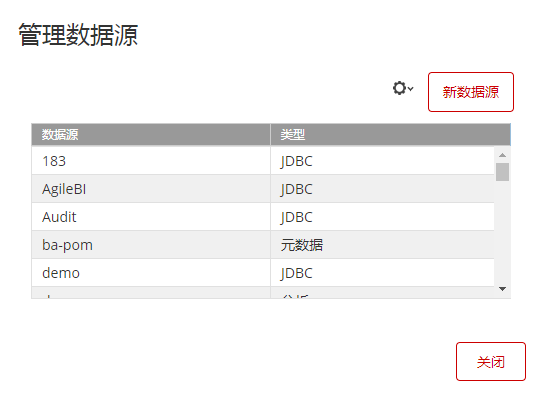
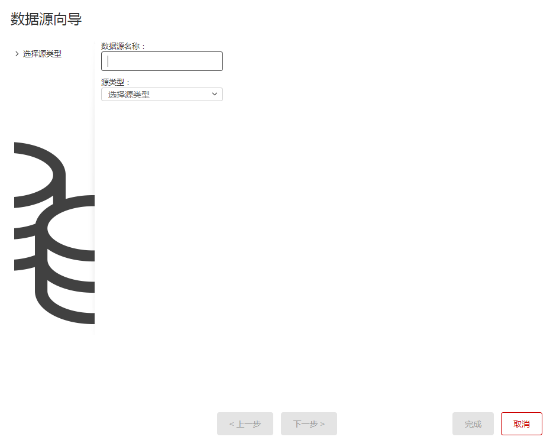
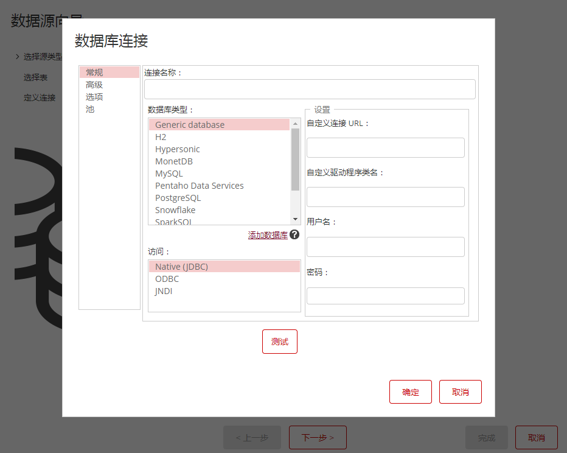
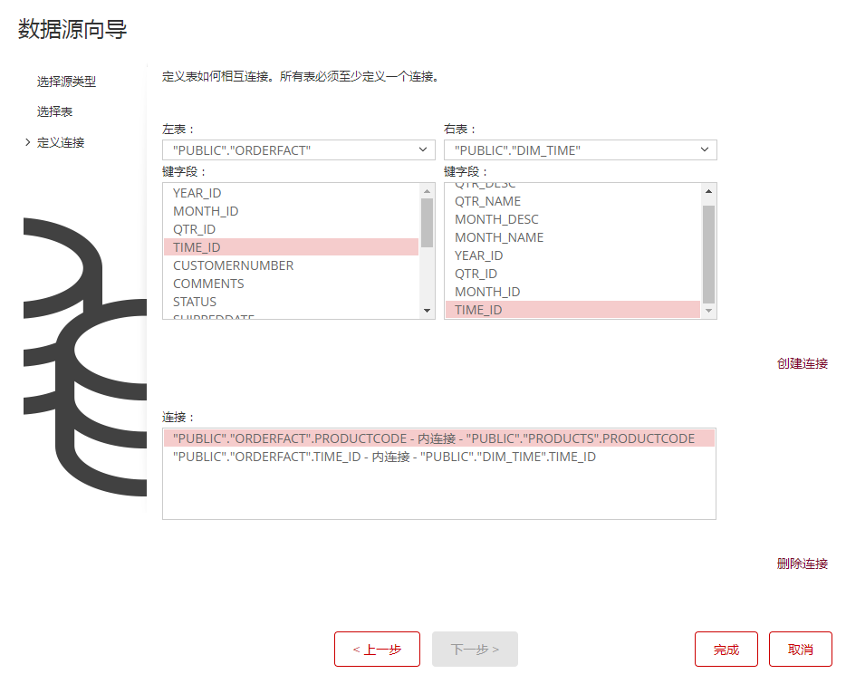
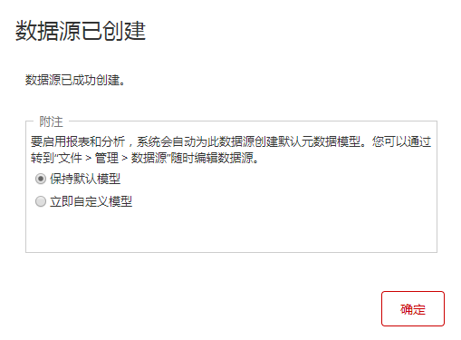
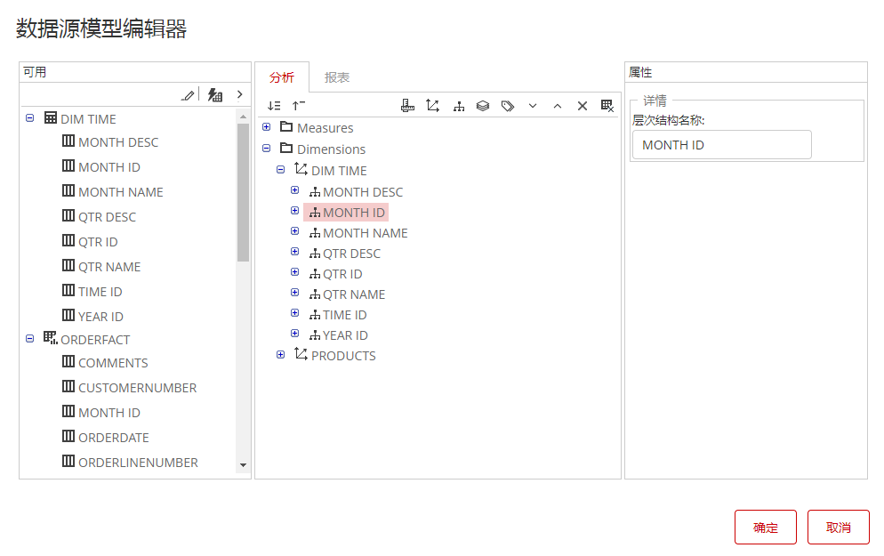

Pentaho的分析模型建立在Mondrian（OLAP）引擎上。OLAP依赖于多维数据模型，数据查询组件通过mdx查询多维数据模型返回数据集。

Pentaho分析模型定义逻辑多维数据库，并将其映射到物理数据模型。分析模型构建了一个多维结构描述层，该结构包含一个或多个立方体、层次结构、层级和度量等元素。

Pentaho提供三种方式构建多维分析模型。

- 数据源向导
- Schema Workbench客户端软件
- Pentaho Data Refinery组件

### “数据源向导”构建多维分析模型

1. 登录Pentaho用户控制台。

2. 从菜单或快捷按钮选择”管理数据源“

3. 点击“新数据源”按钮

   

4. 输入人“数据源名称”，选择数据源类型

   

5. 点击“连接”右侧的“+”新建连接，或者从下面的列表中选择已有的连接

   

6. 选择维度表和事实表

   

7. 创建表关系

   

8. 点击完成按钮

   

9. 选择“保持默认模型”或“立即自定义模型

   

10. 按“确定”完成

### 使用Schema Workbench构建分析模型

Mondrian分析模型本质上是一个XML文件，定义了多维数据结构和物理数据模型的映射关系。您可以通过[Pentaho Schema Workbench](https://help.pentaho.com/Documentation/8.3/Work_with_data/Configure_Mondrian_engine)构建分析模型。

