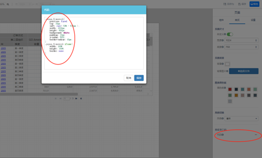
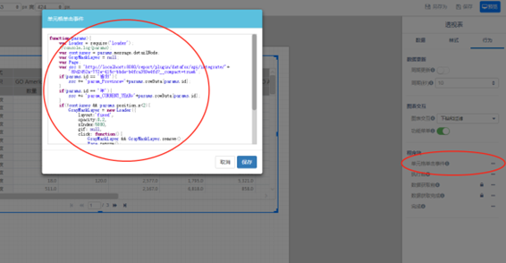
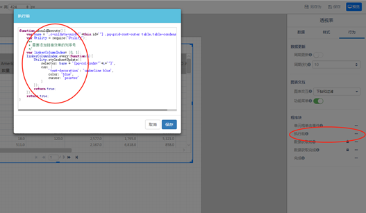

透视表单元格跳转，是指点击某个单元格，跳转到其它页面，并将单元格所对应的维度信息作为筛选条件传递到跳转页面。

1. 添加弹出层样式



​		如图1-1所示激活页面级别样式面板，打开自定义CSS对话框，贴入如下代码

```
popup_framework{
	position: fixed;
	top: 10px;
	left: calc( 50% - 512px );
	width: 1024px;
	height: 600px;
	background: white;
	padding: 10px;
	z-index: 5001;
	border-radius: 10px;
}
.popup_framework iframe{
	width: 100%;
	height: 100%;
	border: none;
}

```

2. 添加弹出层样式

   

   如上图，选中页面中待绑定跳转功能的透视表组件，激活行为面板，打开单元格单击事件对话框，贴入如下代码

   ```
   function(params){
   	var Loader = require('Loader');
   	//console.log(params);
   	var contiunes = params.message.detailNode;
   	var GrayMaskLayer = null;
   	var Page;
   	var src = 'http://localhost:8080/report/plugin/datafor/api/integrate/'+
   		'89d2452a-772e-415c-bbde-b4fca359e4fd?__compact=true&'; 
   	if(params.id == '省份'){
   		src += 'param_Province='+params.rowData[params.id];
   	}
   	if(params.id == '年'){
   		src += 'param_CURRENT_YEAR='+params.rowData[params.id];
   	}
   	if(!contiunes && params.position.x<2){
   		GrayMaskLayer = new Loader({
   			layout:'fixed', 
   			opacity:0.2, 
   			zIndex:5000,
   			gif: null,
   			click: function(){
   				GrayMaskLayer && GrayMaskLayer.remove();
   				Page.remove();
   			}
   		});
   		Page = $('<div class="popup_framework animated fadeInDownBig">');
   		Page.appendTo($('body'));
   		Page.append('<iframe src="'+src+'">');
   	}
   	/*非数据单元格，覆盖图表交互行为*/
   	return contiunes;
   }
   
   ```

   **可能需要修改处**：上述程序中，src变量指向跳转目标页面地址，params.id表示点击单元格所在列的表头。单击事件发生，回调将传入参数params，相关状态信息在params都有携带，可使用console.log打印出来，从中查找需要的信息。


3. 添加单元格超链接效果



如图选中页面中待绑定跳转功能的透视表组件，激活行为面板，打开执行前对话框，贴入如下程序

```
function shouldExecute(){
	var base = '.c-ui[data-uuid="'+this.id+'"] .pq-grid-cont-outer table.table-condensed ';
	var Utility = require('Utility');
	/**
	 * 需要添加链接效果的列序号
	 */
	var linkerColumnIndex= [0, 1];
	linkerColumnIndex.every(function(i){
		Utility.stylesheetUpdate({
			selector: base + '[pq-col-indx="'+i+'"]',
			css: {
				'text-decoration': 'underline blue',
				color: 'blue',
				cursor: 'pointer'
			}
		});
		return true;
	});
	return true;
}

```

**可能需要修改处**：linkerColumnIndex列表保存需要添加跳转效果的列序号。