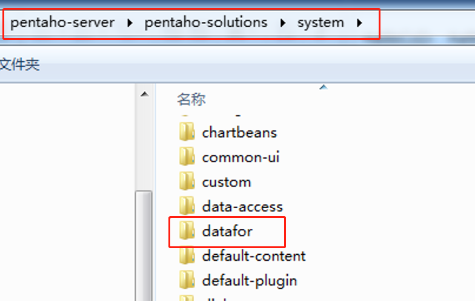
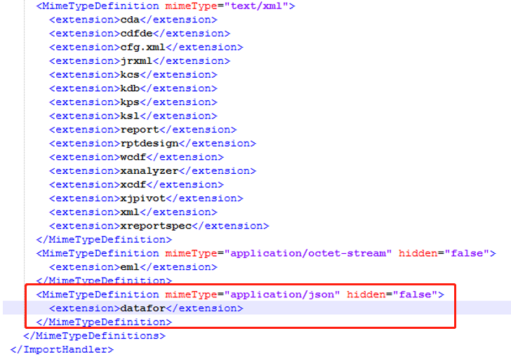
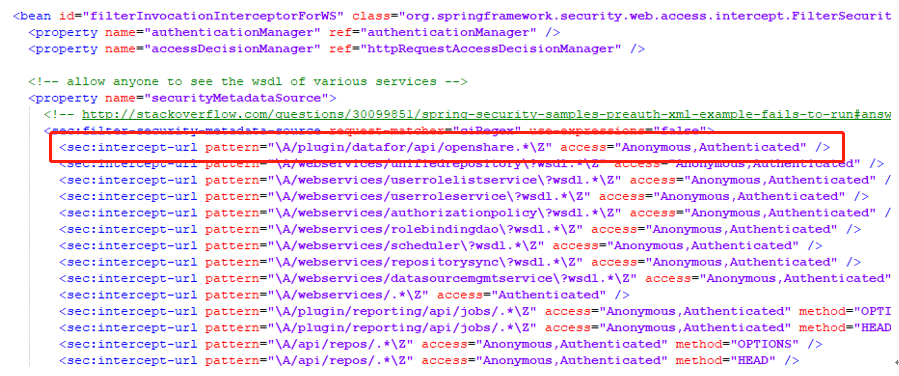

### 下载Datafor

下载地址：

[https://github.com/datafor123/pentaho-plugin ](https://github.com/datafor123/pentaho-plugin )

###  安装Datafor

1. 将datafor.zip解压到  “pentaho-solutions\system” 目录

   

2. 修改“pentaho-solutions\system” 目录下的 ImportHandlerMimeTypeDefinitions.xml 文件，添加如下代码：

   ```xml
   <MimeTypeDefinition mimeType="application/json" hidden="false">
        <extension>datafor</extension>
   </MimeTypeDefinition>
   ```
   

3. 修改“pentaho-solutions\system”目录下的applicationContext-spring-security.xml文件，添加如下代码：

   ```xml
   <sec:intercept-url pattern="\A/plugin/datafor/api/openshare.*\Z" access="Anonymous,Authenticated" />
   ```
   

4. 重启Pentaho PBA，安装完成

