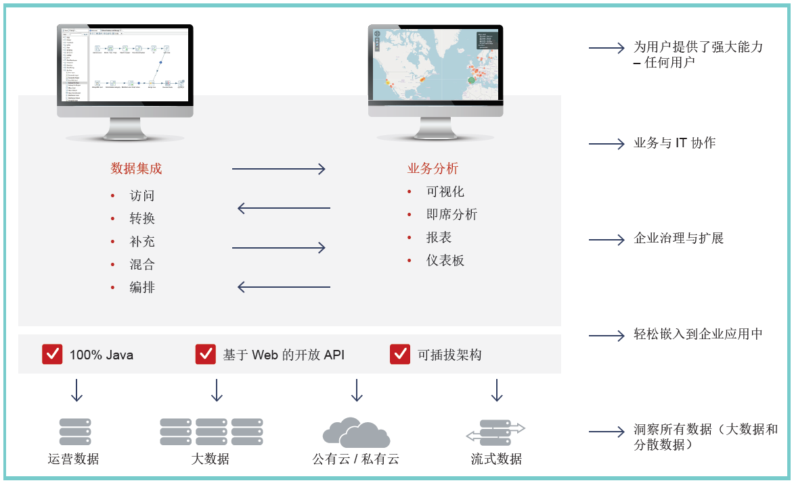
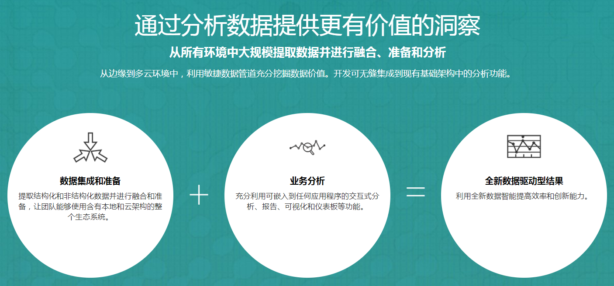

### Pentaho简介
Pentaho---创新的大数据集成分析平台，是世界上最流行的开源大数据集成分析平台。Pentaho的开放性，可嵌入特性，既可以有效利用企业现有的数据基础架构，也能够适应企业未来数据分析应用和技术的变化。

Pentaho主要由两部分组成：Data Integration（PDI）和Business Analytics（PBA）

#### Data Integration（PDI）
PDI是一个端到端的实时数据集成工具，可以支持不断融合不同数据形态，并且支持不断进化的大数据架构。PDI支持网络数据，位置信息，网页数据，社交媒体数据等结构化和非结构化数据的访问和数据集成处理。PDI图形化设计器和丰富的预置组件简化了数据管道的创建。通过PDI，无需任何编程，轻松实现大数据集成，提升团队生产力。
#### Business Analytics（PBA）
Pentaho业务分析软件PBA领先的数据可视化与分析套件，PBA提供了现代化、高响应能力和基于Web的直观界面，可帮助业务用户发现并探索几乎任何数据。借助全面的分析工具，用户可以创建报表和仪表板，并且查看和分析不同维度的数据，而无需寻求IT人员或开发人员的帮助。同时，IT部门可对整个企业进行安全、可扩展和受管制的分析。PBA可以部署在本地或云端，并且可以无缝地嵌入到其他软件应用中。
Pentaho的优势

### Pentaho的优势

#### 数据集成

在从边缘到云端的基础架构中管理和提取日益增多的数据量方面，企业面临的挑战越来越大。借助Pentaho 数据集成 (PDI)，企业可以访问复杂和异构数据源中的数据，并将其与现有关系数据相结合，以生成高质量、随时可用的分析信息。

#### 大数据
Pentaho 平台通过大幅减少设计、开发和部署大数据分析所需的时间并降低复杂性，使企业能够从大量不同数据中获取业务价值。Pentaho 涵盖整个大数据生命周期，即从数据提取和各种数据的准备，再到Spark 和Hadoop 的可扩展处理，从而实现端到端的分析解决方案。

#### 多云支持
增强开放式、可扩展的Pentaho 平台的优势，以满足多云、混合和私有云部署的全面需求。Pentaho 的现代数据架构使用单一数据管理工具而简化日益分散的数据架构的管理。

