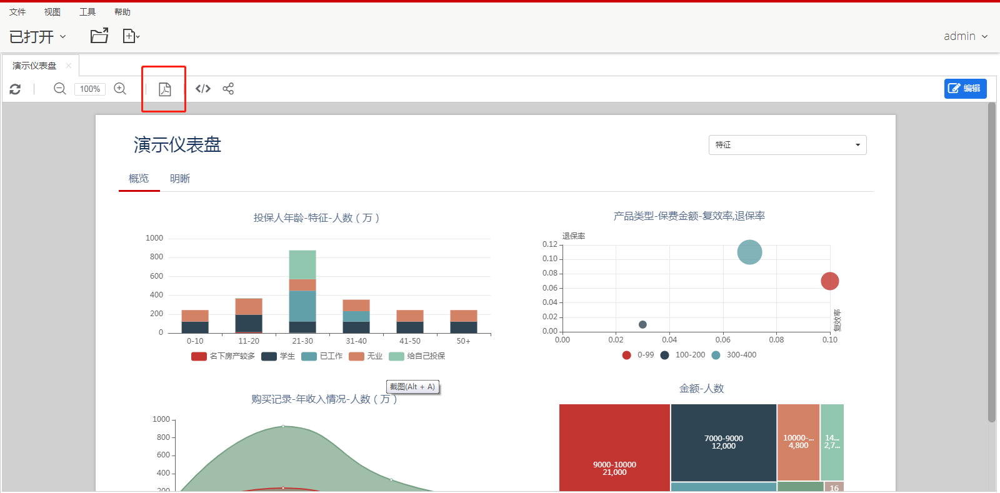
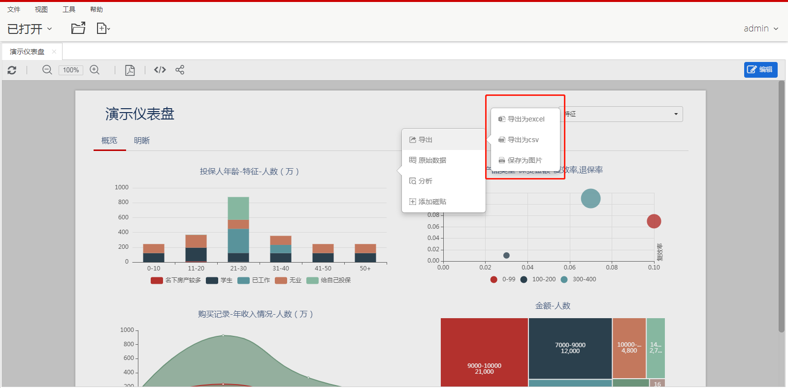

Datafor页面可以导出成PDF、PNG图片、Excel、CSV。

### 从页面导出PDF格式文件
  1. 查看报告。
  2. 点击工具栏上的PDF导出按钮，导出所见即所得的PDF文件。

### 从图表导出数据

  1. 查看报告。
  2. 将鼠标悬停在要导出的图表上。
  3. 在图表的右侧，单击。
  4. 选择导出类型：
  - **导出CSV**会创建一个逗号分隔的文本文件。
  - **导出CSV（Excel）**创建一个逗号分隔的文本文件，其中非ASCII字符已正确编码以在Excel™中使用。
  - **导出PNG**导出PNG格式的图片文件。

   

