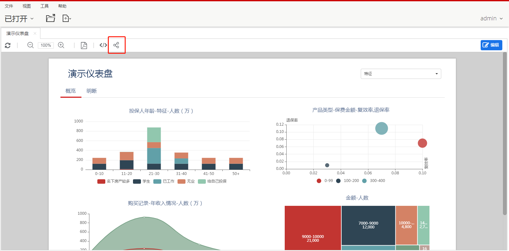
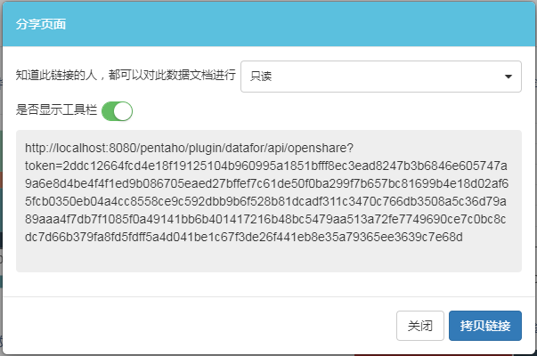

您可以为Visualizer页面生成一个公共访问URL链接，以进行共享，在网页中使用或使用链接执行其他任何操作。任何人都可以通过公共链接访问数据页面，不需要登录，也不需要有任何权限。 通过公共链接访问数据页面的数据权限跟创建公共链接的用户一致，页面操作权限分“只读”和“编辑”。

### 获取公共访问URL链接

1. “查看” Visualizer页面

2. 在工具栏上点击“分享页面”按钮

   

3. 设置操作权限，生成公共链接

