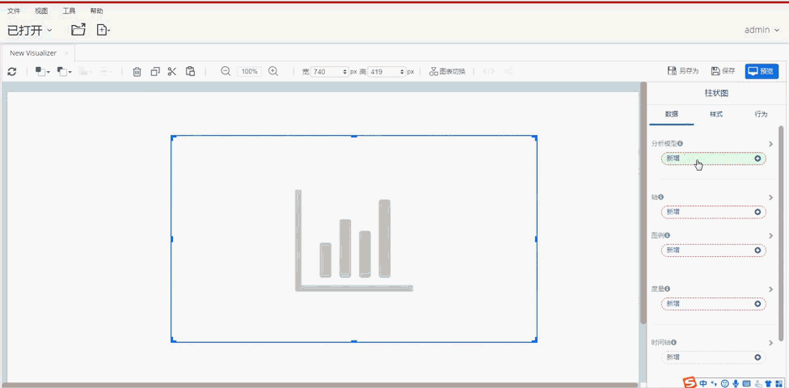
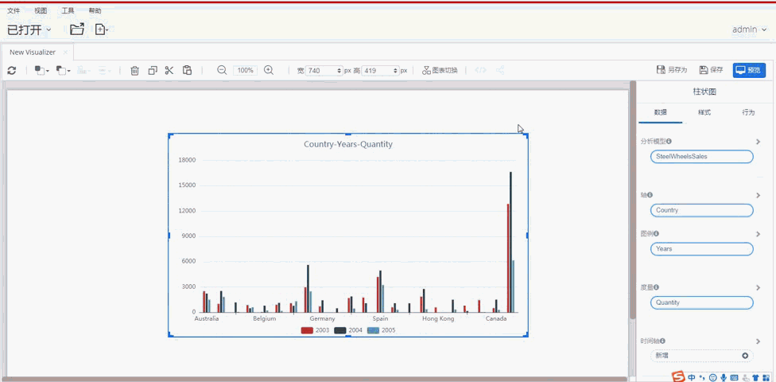
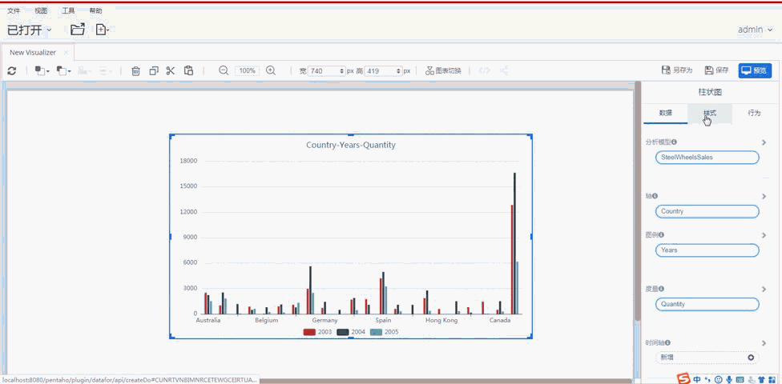

###  将图表添加到报告中

图表可以直观地显示您的数据。Datafor随附了许多预配置的图表，您可以将其添加到报表中，然后根据需要进行自定义。

要将图表添加到当前页面：

1. 编辑您的文档。

2. 在页面属性面板的“组件”标签页中，点击要添加的图表的图标

3. 在画布中拖放以创建新图表。

4. 选择一个或多个图表以根据需要移动或调整它们的大小。

   

###  向图表添加数据

1. 选择一个图表或控件。

2. 确保已选择“数据”选项卡。

3. 在“分析模型”框中选择多维分析模型（Mondrian Schema）。

4. 在其它数据框中添加合适的维度和度量字段。

   

### 替换图表中的字段

1. 选择一个图表或控件。
2. 确保已选择“数据”选项卡。
3. 点击数据框中的字段，重新选择字段

### 从图表中删除字段

1. 选择一个图表或控件。
2. 确保已选择“数据”选项卡。
3. 将鼠标悬停在要删除的字段上。
4. 字段名的右侧，单击**X**。

### 调整组件的位置和大小

- 当您在画布上放置新组件，可以使用鼠标或键盘移动它们。

- 可以使用Ctrl键和鼠标选中多个组件，或用鼠标拖动选中多个组件。

- 可以通过工具栏上的“宽”和“高”输入框，输入像素值调整组件大小。

  

### 改变/切换图表
使用工具栏上的“图表切换”按钮，可以在图表类型中切换。这使您可以使用不同的可视化技术查看数据的外观，选中最合适的图表类型展示数据。切换过程中，根据图表的特性，在数据标签页中保留可以使用的维度和度量字段。

### 编辑图表的样式

在组件属性面板的“样式"标签页中调整组件样式。通过组件样式面板，您可以控制组件的外观，包括字体和背景色，边框阴影，网格显示、轴标签等。

​	

### 设置组件”行为“
在组件属性面板的“行为”标签页中，您可以设置数据图表的数据更新周期，图表的交互行为，并在图表事件中插入自定义程序，实现更高级的可视化与分析。

