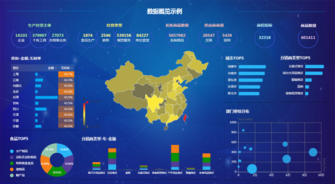
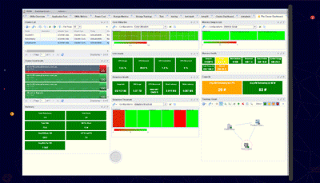

文章来源：锐网云

数据库、数据分析及可视化技术的发展，让企业接入可视化管理技术更加容易，而Dashboard作为企业各项数据的汇总呈现形式，其重要性对于企业决策来说不言而喻。一个好的仪表盘设计既能让企业各阶层工作人员直观地看到关键数据的变化程度，为决策提供有效的信息支持，提升工作效率。

然而，想要设计好一个仪表盘并不容易，甚至是有些挑战性的，对于仪表盘信息密度的规划、呈现的重点以及美观，都需要精心设计。如何在有限的空间内呈现出尽可能多且有价值的信息成为了重点。

**1.明确受众**

万事开头难，想要设计好一个仪表盘的第一步就是要明确使用者是谁，才能更好地明白仪表盘需要展示什么。有很多人认为仪表盘只是企业大数据的实时监控，但实际上通过它所展示出来的信息可以帮助使用者做出更明智的商业决策。

不同岗位的用户对于仪表盘自然有不同的需求，财务自然关注企业的各项成本、收入、资产等数据，销售关注客户的采购量、地区等数据，生产部门自然关注生产线的机器运转状况、原材料消耗、次品率等数据。一是了解到使用者的实际需求，二是将各类所需数据按照重要性在仪表盘上进行布局划分。没有一个仪表盘是放之四海而皆准的，不同部门不同职位，也需要自己独立的仪表盘。

**2.有层次的布局**

仪表盘的布局不能随性而为，按照自己的审美或者单纯为了不留白而将整个仪表盘填补满都是不可取的，整体的信息呈现要有层次感，最重要的信息要让人一眼注目且易于理解。

首先应将与用户主要目标相关的重要信息放在页面的最上方，接下来是一些支持性数据，相互补充的数据图表能帮助使用者做出正确决策。

**3.少即是多**

当企业初次接触数据可视化时，可能会将企业可用的数据源一股脑地利用起来。80/20原则相信大家都听说过，如果作为企业决策的仪表盘充满了各种图表，却毫无重点，那么使用者只会被无用信息所干扰，影响决策效率。基于企业实际任务和实际目标来构建KPI，分清主次，3-5个重点指标就能解决很多问题。

在设计仪表盘的过程中，一是要注意不要使用太多文本内容，只提供清晰的图表标题、标签和解释即可，二是选择合适的图表表示数据。

柱状图最适合表现离散数据、饼图最适合表示占比而折线图适合表现连续数据，这三种图表易于理解，即时布局紧凑也能一目了然。

眼花缭乱的动态3D图表看上去富有科技感，但却不易于理解。企业将大数据进行可视化操作是为了快速筛选原始数据并在短时间内显示相关信息获取更多细节。

大数据仪表盘除了可以实时监控数据变动之外，其实更多的是为了借数据背后所隐藏的信息驱动业务