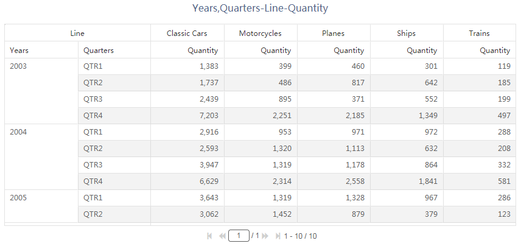

透视表组件，通过交叉表方式显示数据。主要特点如下：

- 交叉表
- 数据汇总
- 单元格合并
- 行列锁定
- 翻页

## 数据

| 数据 | 描述                           |
| ---- | ------------------------------ |
| 行   | 透视表行显示字段、允许多个字段 |
| 列   | 透视表列显示字段、允许多个字段 |
| 度量 | 度量值、允许多个               |

## 样式

<table>
<tr>
    <td><b>类别</b></td>
    <td><b>项目</b></td>
    <td><b>描述</b></td>
</tr><tr>
    <td rowspan="3"> 背景和边框</td>
    <td>背景颜色</td>
    <td>组件背景颜色</td>
</tr><tr>
    <td>边框</td>
    <td>组件背景边框</td>
</tr><tr>
    <td>显示边框阴影</td>
    <td>组件边框阴影</td>
</tr><tr>
    <td rowspan="3"> 网格</td>
    <td>网格</td>
    <td>网格线条颜色和样式</td>
</tr><tr>
    <td>奇数行背景</td>
    <td>奇数行背景颜色</td>
</tr><tr>
    <td>偶数行背景</td>
    <td>偶数行背景颜色</td>
</tr><tr>
    <td rowspan="4">标题</td>
    <td>显示</td>
    <td>标题是否显示</td>
</tr><tr>
    <td>内容</td>
    <td>标题内容</td>
</tr><tr>
    <td>对齐</td>
    <td>标题文字对齐方式</td>
</tr><tr>
    <td>字体</td>
    <td>标题字体、大小、颜色、加粗、斜体</td>
</tr><tr>
    <td rowspan="4">表头</td>
    <td>列对齐</td>
    <td>表头字段对齐方式</td>
</tr><tr>
    <td>表头背景</td>
    <td>表头背景颜色</td>
</tr><tr>
    <td>字体</td>
    <td>表头字体、大小、颜色、加粗、斜体</td>
</tr><tr>
    <td>自动换行</td>
    <td>当文字长度超出单元格边框时换行</td>    
</tr><tr>
    <td rowspan="8">内容</td>
    <td>字体</td>
    <td>表格内容的字体、大小、颜色、加粗、斜体</td>
</tr><tr>
    <td>自动换行</td>
    <td>当文字长度超出单元格边框时换行</td>
</tr><tr>
    <td>维度列背景</td>
    <td>维度列背景颜色</td>
</tr><tr>
    <td>维度列字体</td>
    <td>维度列字体、大小、颜色、粗体、斜体</td>
</tr><tr>
    <td>列对齐</td>
    <td>内容字段对齐方式</td>
</tr><tr>
    <td>行记录</td>
    <td>表格第一列显示行序号</td>
</tr><tr>
    <td>柱图</td>
    <td>柱状图显示度量值</td>
</tr><tr>
    <td>饼图</td>
    <td>饼图显示度量值</td>
</tr><tr>    
    <td rowspan="4">汇总行</td>
    <td>合计行背景</td>
    <td>合计行背景色</td>
</tr><tr>
    <td>合计行字体</td>
    <td>合计行字体、大小、颜色、粗体、斜体</td>
</tr><tr>
    <td>总计行背景</td>
    <td>总计行背景色</td>
</tr><tr>
    <td>总计行字体</td>
    <td>总计行字体、大小、颜色、粗体、斜体</td>
</tr><tr>
    <td rowspan="3">翻页器</td>
    <td>显示翻页器</td>
    <td>是否显示翻页器</td>
</tr><tr>
    <td>翻页器位置</td>
    <td>翻页器水平位置</td>
</tr><tr>
    <td>行/每页</td>
    <td>定义每页显示行数</td>
</tr><tr>
    <td rowspan="2">组件菜单</td>
    <td>启用组件菜单</td>
    <td>是否显示组件背景框上的菜单</td>
</tr><tr>
    <td>工具栏颜色</td>
    <td>组件背景框上方工具按钮的颜色</td>
</tr><tr>
    <td>区域缩放-水平方向</td>
    <td>区域缩放</td>
    <td>是否显示缩放滚动条</td>
</tr>
</table>

## 行为
<table>
<tr>
    <td><b>类别</b></td>
    <td><b>项目</b></td>
    <td><b>描述</b></td>
</tr><tr>
    <td rowspan="2"> 数据更新</td>
    <td>更新周期</td>
    <td>数据是否周期更新</td>
</tr><tr>
    <td>周期（秒）</td>
    <td>数据更新周期、秒为单位</td>
</tr> <tr>
    <td>图表交互</td>
    <td>图表交互</td>
    <td>图表交互行为：无、下钻、筛选、下钻与筛选</td>
</tr> <tr>
    <td rowspan="5"> 自定义过程</td>
    <td>图区单击事件</td>
    <td>在组件单击事件中运行的自定义代码过程</td>
</tr><tr>
    <td>执行前</td>
    <td>在组件执行前运行的自定义代码过程</td>
</tr> <tr>
    <td>数据获取前</td>
    <td>在组件获取数据前运行的自定义代码过程</td>
</tr> <tr>
    <td>数据获取完成</td>
    <td>在组件获取数据后运行的自定义代码过程</td>
</tr> <tr>
    <td>完成</td>
    <td>在组件渲染完成后运行的自定义代码过程</td>
</tr> 
</table> 

