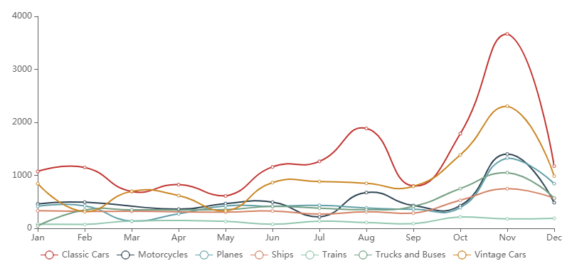

折线图用于显示数据在一个连续的时间间隔或者时间跨度上的变化，它的特点是反映事物随时间或有序类别而变化的趋势。  折线图可能会有一条或多条折线。 折线图有 X 轴和 Y 轴。

一个折线图的构成包括：

- 横轴：表示时间
- 纵轴：表示数值
- 点：表示各个数据的位置
- 线：连接各个数据点

## 数据

| 数据 | 描述                               |
| ---- | ---------------------------------- |
| 轴   | X轴数据字段                        |
| 图例 | 根据图例字段的值的个数显示折线条数 |
| 度量 | Y轴数据字段                        |
## 样式
<table>
<tr>
    <td><b>类别</b></td>
    <td><b>项目</b></td>
    <td><b>描述</b></td>
</tr>
<tr>
    <td rowspan="3"> 背景和边框
    <td>背景颜色</td>
    <td>组件背景颜色</td>
</tr><tr>
    <td>边框</td>
    <td>组件背景边框</td>
</tr>
<tr>
    <td>显示边框阴影</td>
    <td>组件边框阴影</td>
</tr>
<tr>
    <td rowspan="4"> 边距
    <td>顶部</td>
    <td>组件和背景上边框间距</td>
</tr>
<tr>
    <td>底部</td>
    <td>组件和背景下边框间距</td>
</tr>
<tr>
    <td>左侧</td>
    <td>组件和背景左侧边框间距</td>
</tr>
<tr>
    <td>右侧</td>
    <td>组件和背景右侧边框间距</td>
</tr>
    <tr>
    <td rowspan="4">标题</td>
    <td>显示</td>
    <td>标题是否显示</td>
</tr>
<tr>
    <td>内容</td>
    <td>标题内容</td>
</tr>
<tr>
    <td>对齐</td>
    <td>标题文字对齐方式</td>
</tr>
<tr>
    <td>字体</td>
    <td>标题字体、大小、颜色、加粗、斜体</td>
</tr>
</tr>
    <tr>
    <td>空值处理</td>
    <td>空值处理为</td>
    <td>空值在折线上的显示方式，包括“不显示”、“零值”、“断开”、"线性值"</td>
</tr>
</tr>
    <tr>
    <td rowspan="3">折线</td>
    <td>线粗</td>
    <td>折线粗细</td>
</tr>
<tr>
    <td>圆点尺寸</td>
    <td>折线上数据点大小</td>
</tr>
<tr>
    <td>光滑</td>
    <td>折线是否光滑显示</td>
</tr>
</tr>
    <td rowspan="7">X轴</td>
    <td>显示</td>
    <td>是否显示X轴</td>
</tr>
<tr>
    <td>轴线条</td>
    <td>轴线条粗细和线条样式</td>
</tr>
<tr>
    <td>显示刻度文本</td>
    <td>是否在轴上显示刻度文本</td>
</tr>
<tr>
    <td>轴刻度文本</td>
    <td>刻度文本字体、大小、颜色、粗体、斜体</td>
</tr>
<tr>
    <td>刻度文本全显示</td>
    <td>显示全部刻度文本</td>
</tr>
<tr>
    <td>刻度文本旋转</td>
    <td>刻度文本旋转角度</td>
</tr>
<tr>
    <td>显示轴名称</td>
    <td>显示轴的名称，默认为轴数据字段的名称</td>
</tr>
</tr>
    <td rowspan="6">Y轴</td>
    <td>显示</td>
    <td>是否显示Y轴</td>
</tr>
<tr>
    <td>轴线条</td>
    <td>轴线条粗细和线条样式</td>
</tr>
<tr>
    <td>显示刻度文本</td>
    <td>是否在轴上显示刻度文本</td>
</tr>
<tr>
    <td>轴刻度文本</td>
    <td>刻度文本字体、大小、颜色、粗体、斜体</td>
</tr>
<tr>
    <td>最小值作为Y轴的起始值</td>
    <td>最大值作为Y轴的结束值</td>
</tr>
<tr>
    <td>显示轴名称</td>
    <td>显示轴的名称，默认为轴数据字段的名称</td>
</tr>
</tr>
    <td rowspan="3">网格</td>
    <td>显示X轴网格线</td>
    <td>是否显示X轴垂直的网格线</td>
</tr>
<tr>
    <td>X轴网格线</td>
    <td>轴线条粗细和线条样式</td>
</tr>
<tr>
    <td>显示Y轴网格线</td>
    <td>轴线条粗细和线条样式</td>
</tr>
</tr>
    <td rowspan="6">图例</td>
    <td>显示</td>
    <td>是否显示图例</td>
</tr>
<tr>
    <td>字体</td>
    <td>图例字体、大小、颜色、粗体、斜体</td>
</tr>
<tr>
    <td>朝向</td>
    <td>水平显示或垂直显示图例</td>
</tr>
<tr>
    <td>水平位置</td>
    <td>水平方向位置</td>
</tr>
<tr>
    <td>垂直位置</td>
    <td>垂直方向位置</td>
</tr>
<tr>
    <td>分页</td>
    <td>图例是否分页显示</td>
</tr>
</tr>
    <td rowspan="2">组件菜单</td>
    <td>启用组件菜单</td>
    <td>是否显示组件背景框上的菜单</td>
</tr>
</tr>
    <td>工具栏颜色</td>
    <td>组件背景框上方工具按钮的颜色</td>
</tr>
</tr>
    <td>区域缩放-水平方向</td>
    <td>区域缩放</td>
    <td>是否显示缩放滚动条</td>
</tr>
</table>

## 行为

<table>
<tr>
    <td><b>类别</b></td>
    <td><b>项目</b></td>
    <td><b>描述</b></td>
</tr>
<tr>
    <td rowspan="2"> 数据更新</td>
    <td>更新周期</td>
    <td>数据是否周期更新</td>
</tr>
<tr>
    <td>周期（秒）</td>
    <td>数据更新周期、秒为单位</td>
</tr> 
<tr>
    <td>图表交互</td>
    <td>图表交互</td>
    <td>图表交互行为：无、下钻、筛选、下钻与筛选</td>
</tr> 
<tr>
    <td rowspan="5"> 自定义过程</td>
    <td>图区单击事件</td>
    <td>在组件单击事件中运行的自定义代码过程</td>
</tr>
<tr>
    <td>执行前</td>
    <td>在组件执行前运行的自定义代码过程</td>
</tr>  
<tr>
    <td>数据获取前</td>
    <td>在组件获取数据前运行的自定义代码过程</td>
</tr>   
<tr>
    <td>数据获取完成</td>
    <td>在组件获取数据后运行的自定义代码过程</td>
</tr>  
<tr>
    <td>完成</td>
    <td>在组件渲染完成后运行的自定义代码过程</td>
</tr>      
</table>    