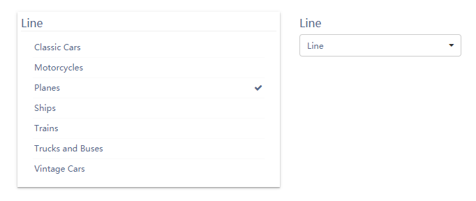

折线图用于显示数据在一个连续的时间间隔或者时间跨度上的变化，它的特点是反映事物随时间或有序类别而变化的趋势。  折线图可能会有一条或多条折线。 折线图有 X 轴和 Y 轴。

列表组件用来显示维度字段内容，通过选择列表项，过滤“订阅”此列表组件的相关数据组件。列表组件有2种显示形式：

- 列表框（单选和多选）
- 下拉框（单选和多选）

## 数据

| 数据   | 描述                       |
| ------ | -------------------------- |
| 维度   | 维度字段                   |
| 多选   | 是否允许多选（默认为单选） |
| 默认值 | 设置默认选中值             |

## 样式

<table>
<tr>
    <td><b>类别</b></td>
    <td><b>项目</b></td>
    <td><b>描述</b></td>
</tr><tr>
    <td rowspan="3"> 背景和边框</td>
    <td>背景颜色</td>
    <td>组件背景颜色</td>
</tr><tr>
    <td>边框</td>
    <td>组件背景边框</td>
</tr><tr>
    <td>显示边框阴影</td>
    <td>组件边框阴影</td>
</tr><tr>
    <td rowspan="4">标题</td>
    <td>显示</td>
    <td>标题是否显示</td>
</tr><tr>
    <td>内容</td>
    <td>标题内容</td>
</tr><tr>
    <td>对齐</td>
    <td>标题文字对齐方式</td>
</tr><tr>
    <td>字体</td>
    <td>标题字体、大小、颜色、加粗、斜体</td>
</tr><tr>
    <td rowspan="2">列表项目</td>
    <td>字体</td>
    <td>列表项目的字体、大小、颜色、加粗、斜体</td>
</tr><tr>
    <td>网格线条颜色</td>
    <td>列表项分割线条颜色</td>
</tr><tr>
    <td rowspan="2">其它</td>
    <td>类型</td>
    <td>列表框或者下拉框样式选择</td>
</tr><tr>
    <td>模糊搜索</td>
    <td>是否显示模糊搜索</td>
</tr>
</table>

## 行为
<table>
<tr>
    <td><b>类别</b></td>
    <td><b>项目</b></td>
    <td><b>描述</b></td>
</tr><tr>
    <td > 订阅</td>
    <td>订阅者</td>
    <td>跟此列表组件相关的数据组件</td>
</tr> <tr>
    <td rowspan="5"> 自定义过程</td>
    <td>变化前</td>
    <td>数据变化前运行的自定义代码过程</td>
</tr><tr>
    <td>执行前</td>
    <td>在组件执行前运行的自定义代码过程</td>
</tr> <tr>
    <td>数据获取完成</td>
    <td>在组件获取数据后运行的自定义代码过程</td>
</tr> 
</table> 

