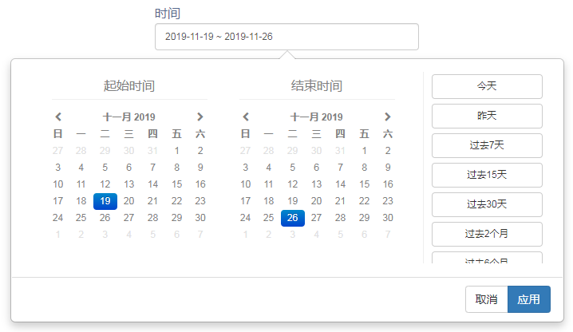

时间组件用来选择时间范围。时间范围传递到跟此组件建立了“订阅”关系的其它数据组件。时间组件允许过滤特定的时间字段或者数据组件的“时间轴”字段。

时间组件提供三种时间类型选择器：

- 日期
- 月份
- 年份

## 数据

| 数据     | 描述                                 |
| -------- | ------------------------------------ |
| 时间类型 | 时间类型：天、月、年                 |
| 时间字段 | 时间轴或指定时间字段。               |
| 默认值   | 设置默认选中值。固定时间或相对时间。 |

## 样式

<table>
<tr>
    <td><b>类别</b></td>
    <td><b>项目</b></td>
    <td><b>描述</b></td>
</tr><tr>
    <td rowspan="3"> 标签名称</td>
    <td>显示</td>
    <td>是否显示标签</td>
</tr><tr>
    <td>标签文本</td>
    <td>标签文本</td>
</tr><tr>
    <td>字体</td>
    <td>标题字体、大小、颜色、加粗、斜体</td>
</tr>
</table>

## 行为
<table>
<tr>
    <td><b>类别</b></td>
    <td><b>项目</b></td>
    <td><b>描述</b></td>
</tr><tr>
    <td > 订阅</td>
    <td>订阅者</td>
    <td>跟此列表组件相关的数据组件</td>
</tr>
</table> 

