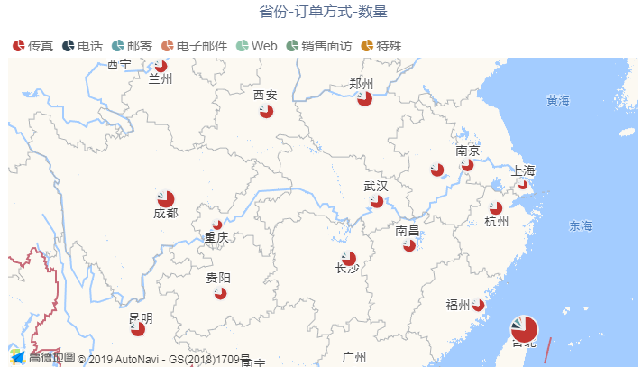

着色地图使用颜色来显示不同地理位置或区域之间的值在比例上有何不同。Datafor插件内置“高德地图”作为GIS地图引擎（用户需自行购买高德地图服务）。

## 数据

| 数据     | 描述               |
| -------- | ------------------ |
| 地理字段 | 地区名称字段       |
| 经度     | 地点的经度         |
| 纬度     | 地点的维度         |
| 图例     | 标记饼图的图例字段 |
| 度量     | 度量字段           |

## 样式

<table>
<tr>
    <td><b>类别</b></td>
    <td><b>项目</b></td>
    <td><b>描述</b></td>
</tr><tr>
    <td rowspan="2"> 背景和边框</td>
    <td>边框</td>
    <td>组件背景边框</td>
</tr><tr>
    <td>显示边框阴影</td>
    <td>组件边框阴影</td>
</tr><tr>
    <td rowspan="4">标题</td>
    <td>显示</td>
    <td>标题是否显示</td>
</tr><tr>
    <td>内容</td>
    <td>标题内容</td>
</tr><tr>
    <td>对齐</td>
    <td>标题文字对齐方式</td>
</tr><tr>
    <td>字体</td>
    <td>标题字体、大小、颜色、加粗、斜体</td>
</tr><tr>
    <td rowspan="3">地图标记</td>
    <td>最小气泡</td>
    <td>最小度量值显示的气泡大小</td>
</tr><tr>
    <td>最大气泡</td>
    <td>最大度量值显示的气泡大小</td>
</tr><tr>
    <td>数量</td>
    <td>显示的气泡数量，根据度量值排序</td>
</tr><tr>
    <td rowspan="4">图例</td>
    <td>显示</td>
    <td>是否显示图例</td>
</tr><tr>
    <td>字体</td>
    <td>图例字段的字体、大小、颜色、加粗、斜体</td>
</tr><tr>
    <td>垂直位置</td>
    <td>图例的显示位置</td>
</tr><tr>
    <td>对齐</td>
    <td>图例的水平位置</td>
</tr><tr>
    <td>辅助功能</td>
    <td>地图风格</td>
    <td>地图的样式风格模板</td>
</tr><tr>
    <td rowspan="2">组件菜单</td>
    <td>启用组件菜单</td>
    <td>是否显示组件背景框上的菜单</td>
</tr><tr>
    <td>工具栏颜色</td>
    <td>组件背景框上方工具按钮的颜色</td>
</tr>
</table>

## 行为
<table>
<tr>
    <td><b>类别</b></td>
    <td><b>项目</b></td>
    <td><b>描述</b></td>
</tr><tr>
    <td rowspan="2"> 数据更新</td>
    <td>更新周期</td>
    <td>数据是否周期更新</td>
</tr><tr>
    <td>周期（秒）</td>
    <td>数据更新周期、秒为单位</td>
</tr> <tr>
    <td>图表交互</td>
    <td>图表交互</td>
    <td>图表交互行为：无、下钻、筛选、下钻与筛选</td>
</tr> <tr>
    <td rowspan="5"> 自定义过程</td>
    <td>图区单击事件</td>
    <td>在组件单击事件中运行的自定义代码过程</td>
</tr><tr>
    <td>执行前</td>
    <td>在组件执行前运行的自定义代码过程</td>
</tr> <tr>
    <td>数据获取前</td>
    <td>在组件获取数据前运行的自定义代码过程</td>
</tr> <tr>
    <td>数据获取完成</td>
    <td>在组件获取数据后运行的自定义代码过程</td>
</tr> <tr>
    <td>完成</td>
    <td>在组件渲染完成后运行的自定义代码过程</td>
</tr> 
</table> 

