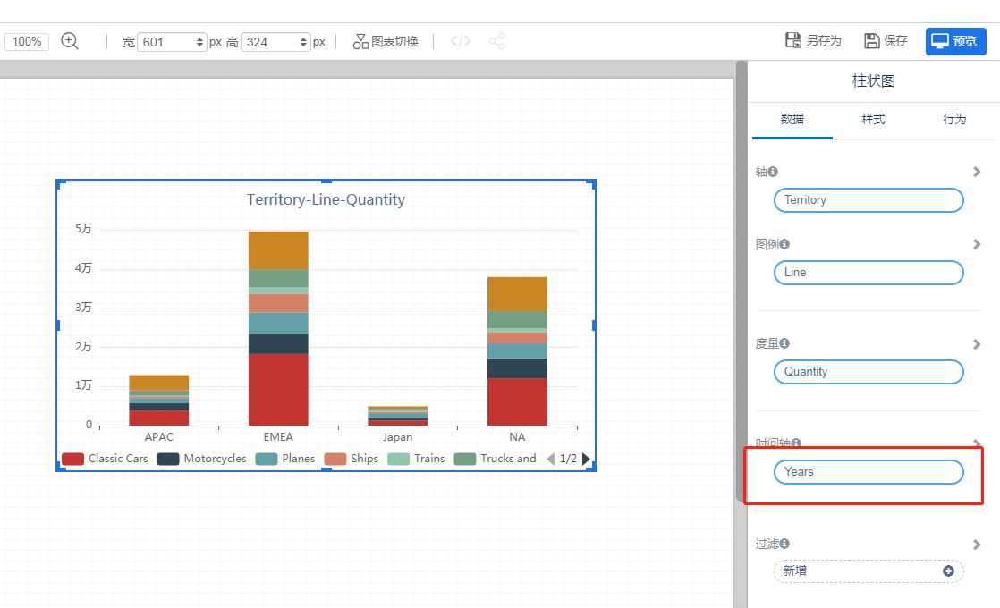
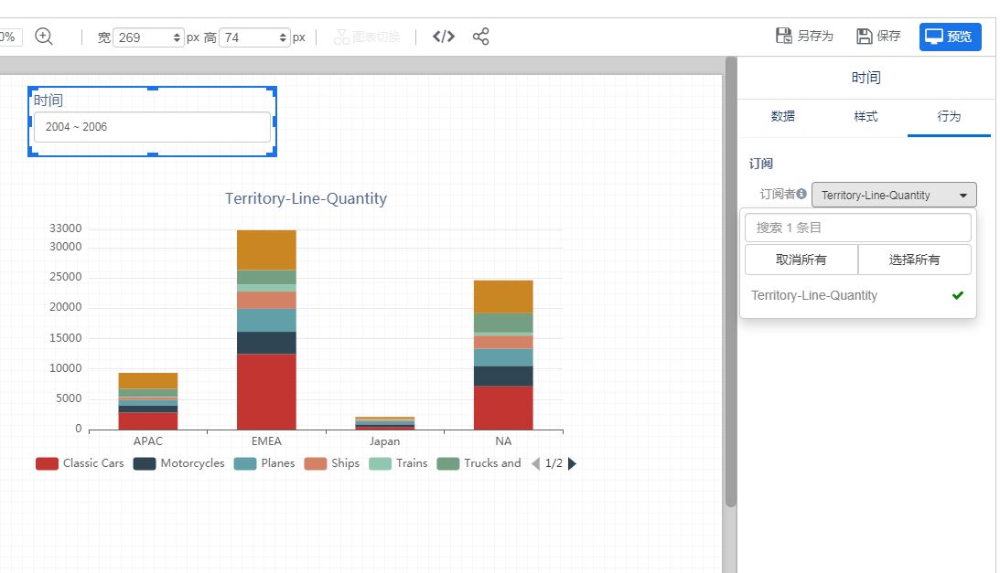

”时间轴“字段是跟”时间筛选器“自动关联的字段。通过时间筛选器的时间范围选择，影响和过滤设置了”时间轴“字段的数据组件数据。
- 时间轴字段，必须是模型中的时间类型字段。
- “时间筛选器”只影响相同时间类型的时间轴范围

1. 数据组件添加“时间轴”字段

   

2. 页面上添加“时间筛选器”

   

3. 设置“时间筛选器”的“订阅者”，只有设置了“时间轴”的组件才会出现在“订阅者”列表中
   