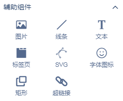

添加静态设计元素可以为您的数据故事增加视觉吸引力和上下文。最佳做法是，谨慎使用这些元素，以免使报表看起来混乱或分散数据的注意力。

静态设计元素在组件标签页的“辅助”分类中，将以下组件添加到您的报告中：

1. 文本
2. 图片
3. 线
4. 长方形
5. 圈

### 添加文字

使用文字可以在页面中添加页面标题和描述或其它文字描述内容。

1. 在组件辅助组件分类中，单击“ **文本”**图标。
2. 在画布上画一个框。
3. 在框中输入您的文字。

#### 设置文字样式

1. 在组件辅助组件分类中，选择**文字**。
2. 在样式标签页更改字体，大小，颜色，填充和文本的其他方面。

### 新增图片

使用图像将徽标和图形添加到报告中。

1. 在组件辅助组件分类中，单击**“ 图片”**图标。

2. 在画布上画一个想要显示图像的框。框的大小确定图像的大小

3. 从硬盘驱动器中选择一个图像文件。

   您可以添加最常见的图像文件格式，例如.png，.jpg等。

4. 使用样式标签页更改背景和边框选项。

### 添加矩形和圆形

使用形状创建数据元素，横幅和其他图形效果的视觉分隔。

1. 在组件辅助组件分类中，单击“ **矩形”**或“ **圆形”**图标。
2. 在画布上画一个想要显示形状的框。
3. 在样式标签页更改形状的外观。

### 添加线条

使用线条风格页面区域，或连接报表中的元素。

1. 在组件辅助组件分类中，单击“ **线条”**图标。
2. 在画布上画一条线。
3. 在样式标签页更改线的外观。