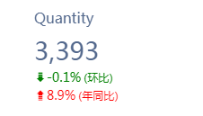
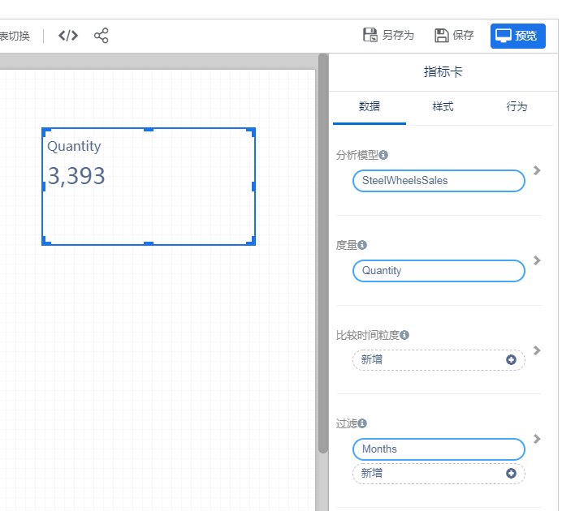
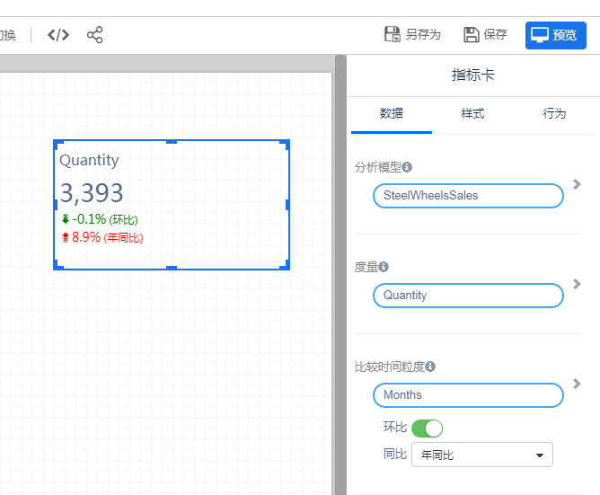
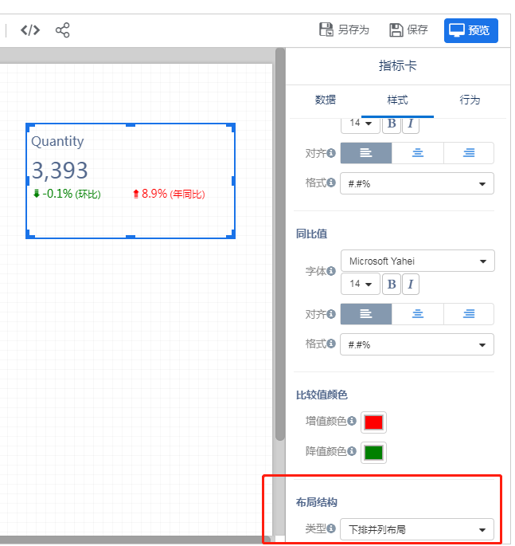

指标卡用来显示一个数字，例如总销售金额、市场份额。指标卡也可以显示指标的同比或环比值。

### 创建指标卡
跟其它组件一样，组件面板中选择“指标卡”，在画布的合适位置添加指标卡。
在指标卡对应的数据面板中选择“度量”。

### 设置同环比

1. 选择“比较时间粒度”字段。比较时间粒度是指同环比的比较时间，支持：月份、季度或年

   **注：“比较时间粒度字段”必须是模型中的时间类型字段**

2. 打开”环比“开关，或者在同比下拉框中选择”同比类型“

   | 时间l粒度 | 同比             | 环比     |
   | --------- | ---------------- | -------- |
   | 月份      | 年同比、季度同比 | 月环比   |
   | 季度      | 年同比           | 季度环比 |
   | 年        | 无               | 年环比   |

   
### 同环比显示位置布局

在样式面板中设置“布局结构”

